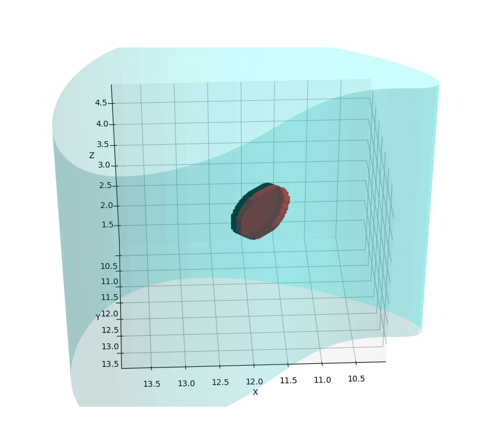

# Make-pole-plate-on-body-

## Author

The copyright of this code on Yongha GI in BMPL(Bio Medical Physic Laboratory) in [Korea University](http://www.korea.ac.kr/mbshome/mbs/university/index.do)  

Permission is hereby granted, free of charge, as dictated by the [CC0-1.0 lincense](LICENSE). 
So any body can use, copy, modify, merge, publish, distribute, sublicense and sell without restriction.
If you used/modified this code, then please comment the original authorship and 'Thank you' 

I mainly use Korean, so annotation is written with Korean 
This project isn’t finished yet, thus there might be some uncompleted codes included in this repository.

## Description

This code was made for a purpose to make easily some pole plate on human body.
Basically shape of the pole plate is circle. And it has hydrogel layer to attach on human body.
Another reason of presence of this hydrogel layer is to avoid burning damage on skin   

